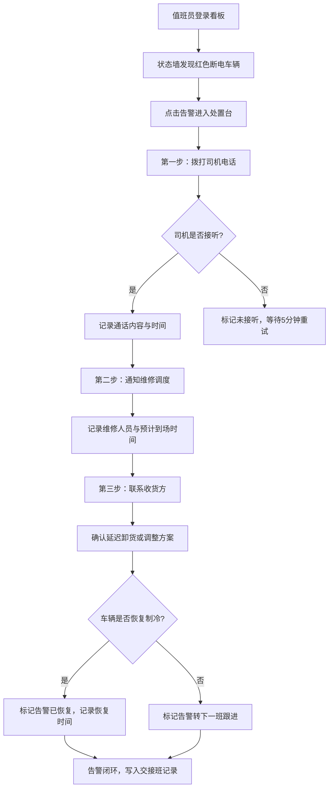

## 1. 产品概述

冷链调度夜班 Web 看板，面向运输公司运营中心值班员，用于夜间盯防多辆冷藏车的断电风险。通过三个核心模块（车辆状态墙、告警处置台、交接班记录）让夜班人员在两三个屏幕内快速掌握：先处理哪辆车、该联系谁、有没有形成闭环。

---

## 2. 核心功能

### 2.1 用户角色

| 角色 | 说明 | 核心权限 |
|------|------|----------|
| 夜班值班员 | 运营中心夜间值守人员 | 查看车辆状态、处置告警、记录交接班 |

### 2.2 功能模块

1. **车辆状态墙**：按线路/货主/温区分组展示车辆卡片，夜间断电车辆红色高亮突出
2. **告警处置台**：逐条处理告警，按预设流程执行操作并记录时间与结果
3. **交接班记录**：自动汇总未关闭告警、已恢复车辆、货损风险跟进项

### 2.3 页面详情

| 页面名称 | 模块名称 | 功能描述 |
|----------|----------|----------|
| 主看板 | 顶部导航栏 | 显示当前班次、值班员姓名、当前时间、告警统计数 |
| 主看板 | 车辆状态墙 | 分组车辆卡片（正常/预警/断电三种状态），断电车辆红色闪烁边框，显示：车牌号、司机姓名+电话、当前位置、货品批次、温区要求、断电持续分钟数、温度曲线趋势 |
| 主看板 | 告警处置台 | 告警列表按优先级排序，点击展开处置流程：拨打司机→通知维修→联系收货方，每步记录操作时间、联系结果、备注；支持标记告警关闭/转下一班 |
| 主看板 | 交接班记录 | 自动汇总本班次：未关闭告警列表、已恢复车辆列表、货损风险跟进项；支持一键生成交班摘要、接班确认 |

---

## 3. 核心流程

### 3.1 告警处置流程

### 3.2 交接班流程

---

## 4. 用户界面设计

### 4.1 设计风格

- **主色调**：深海蓝 `#0B1929` 背景，搭配冷青色 `#00D4FF` 强调，告警红 `#FF2D55` 高对比闪烁
- **辅助色**：正常绿 `#30D158`、预警橙 `#FF9F0A`、断电红 `#FF2D55`、信息蓝 `#64D2FF`
- **按钮风格**：扁平直角，3px 描边，按下时有凹陷效果，告警按钮带脉冲动画
- **字体**：JetBrains Mono 等宽字体（数据显示）+ Noto Sans SC（中文正文），大字号数字配小字号标签
- **布局风格**：三栏等分布局 + 顶部状态条，卡片式分组，赛博工业/监控中心美学
- **视觉细节**：全局微噪点纹理、扫描线动画、数据数字动态滚动、卡片玻璃拟态边框发光
- **图标风格**：线性简洁图标，告警图标带发光描边

### 4.2 页面设计概览

| 页面名称 | 模块名称 | UI 元素 |
|----------|----------|---------|
| 主看板 | 顶部状态条 | 左侧：Logo + 班次信息；中间：实时时钟（大字号）+ 当前值班员；右侧：三级告警计数器（红色/橙色/绿色数字徽章） |
| 主看板 | 车辆状态墙（左栏） | 分组标题带折叠箭头，每组内车辆卡片网格排列；断电卡片：红色渐变背景 + 脉冲边框动画 + 闪烁断电指示灯 + 大号倒计时分钟数 |
| 主看板 | 告警处置台（中栏） | 告警列表按优先级（断电>预警）排序，每条告警可展开；展开后显示三步处置流程时间线，每步有操作按钮和结果输入框 |
| 主看板 | 交接班记录（右栏） | 三个分区卡片：未关闭告警、已恢复车辆、货损风险跟进；底部交班摘要生成按钮 + 接班确认按钮 |

### 4.3 响应式

- **桌面优先设计**：适配 1920×1080 及以上分辨率，三栏并排展示
- **中等屏幕**：1366×768 分辨率下状态墙与处置台左右分栏，交接班记录折叠为底部抽屉
- **触控优化**：按钮最小 44×44px，卡片点击热区扩大

---
