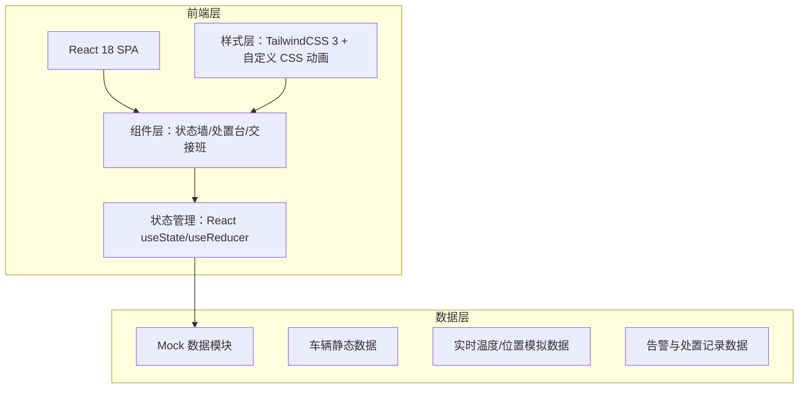
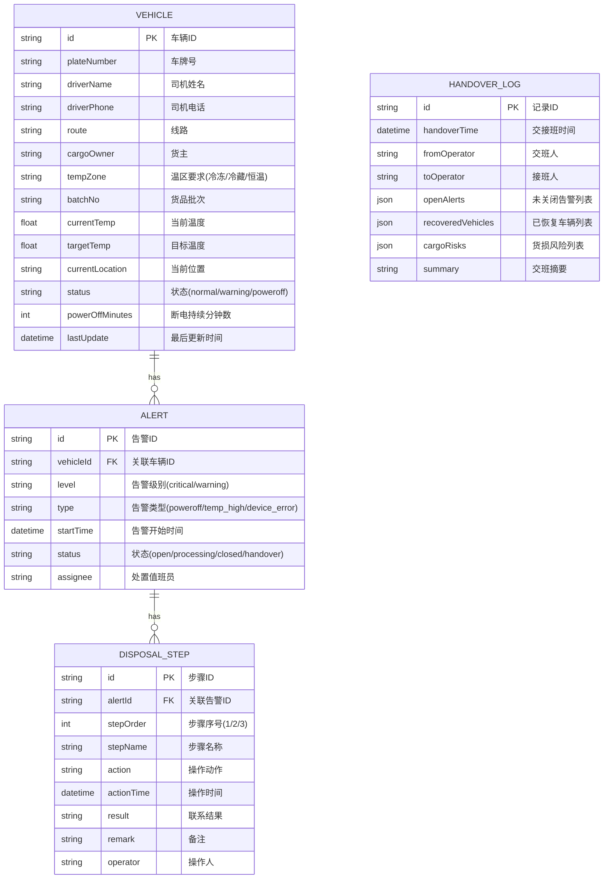

## 1. 架构设计



## 2. 技术描述

- **前端框架**：React@18 + TypeScript
- **构建工具**：Vite@5
- **样式方案**：TailwindCSS@3 + 自定义 CSS 变量 + 原生 CSS 动画（关键帧）
- **状态管理**：React Hooks（useState / useReducer / useEffect），不引入额外状态库
- **图标方案**：lucide-react 线性图标库
- **字体方案**：Google Fonts - JetBrains Mono（数字数据） + Noto Sans SC（中文）
- **后端**：无后端，前端内置 Mock 数据模拟实时更新
- **数据持久化**：localStorage 存储交接班记录与告警处置状态

## 3. 路由定义

| Route | 页面用途 |
|-------|----------|
| `/` | 主看板页面，三栏布局展示全部模块 |

单页应用，无路由跳转，所有模块在同一页面通过 Tab/折叠切换可见性。

## 4. 数据模型

### 4.1 数据实体定义



### 4.2 TypeScript 类型定义

```typescript
type VehicleStatus = 'normal' | 'warning' | 'poweroff';
type TempZone = 'frozen' | 'chilled' | 'constant';
type AlertLevel = 'critical' | 'warning';
type AlertType = 'poweroff' | 'temp_high' | 'device_error';
type AlertStatus = 'open' | 'processing' | 'closed' | 'handover';

interface Vehicle {
  id: string;
  plateNumber: string;
  driverName: string;
  driverPhone: string;
  route: string;
  cargoOwner: string;
  tempZone: TempZone;
  batchNo: string;
  currentTemp: number;
  targetTemp: number;
  currentLocation: string;
  status: VehicleStatus;
  powerOffMinutes: number;
  lastUpdate: Date;
  tempHistory: number[];
}

interface DisposalStep {
  id: string;
  stepOrder: 1 | 2 | 3;
  stepName: string;
  action: string;
  actionTime: Date | null;
  result: string;
  remark: string;
  operator: string;
  completed: boolean;
}

interface Alert {
  id: string;
  vehicleId: string;
  level: AlertLevel;
  type: AlertType;
  startTime: Date;
  status: AlertStatus;
  assignee: string;
  steps: DisposalStep[];
}

interface HandoverLog {
  id: string;
  handoverTime: Date;
  fromOperator: string;
  toOperator: string;
  openAlerts: string[];
  recoveredVehicles: string[];
  cargoRisks: { vehicleId: string; description: string; level: string }[];
  summary: string;
  confirmed: boolean;
}
```
